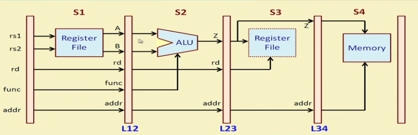

# Hardware Modeling Using Verilog - NPTEL

By Prof. Indranil Sengupta (IIT Kharagpur)
Week 7 - Lecture 34 : PIPELINE MODELING (PART 2)

- Considers a more complex example that involves register bank, ALU and memory and shows how it can be mapped to a four-stage pipeline.
- Shows how two-phase clocking can be used to avoid races.
- Illustrates how the pipeline can be modeled in Verilog, and also how to write the corresponding test bench. 

Pipeline:  

Image credits to NPTEL