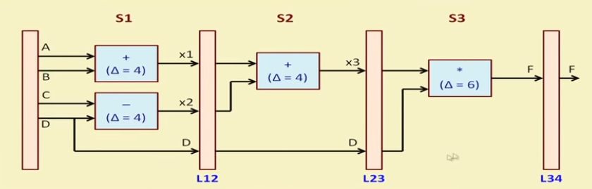

# Hardware Modeling Using Verilog - NPTEL

By Prof. Indranil Sengupta (IIT Kharagpur)
Week 7 - Lecture 33 : PIPELINE MODELING (PART 1)

    • Considers a simple example and shows how it can be mapped to a three-stage pipeline.
    • Illustrates how the pipeline can be modeled in Verilog, and also how to write the corresponding test bench. 

Pipeline:  

Image credits to NPTEL