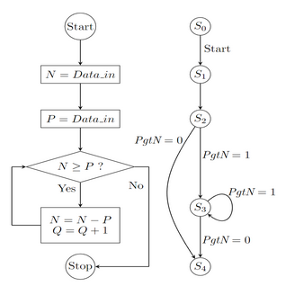

# Hardware Modeling Using Verilog - NPTEL

By Prof. Indranil Sengupta (IIT Kharagpur)
Week 6: Programming Assignment - Division by Repeated Subtraction

Design a 16-bit divider by implementing the data path and control path separately. The operation will take as inputs divisor p and dividend n, and provides outputs quotient q and remainder r such that n = p x q + r. At the beginning two registers P and N will be loaded with p and n respectively. At each iteration p will be subtracted from N, storing the result back in N, as long as p <= N, and also increment a counter Q that is initialized to 0. At the end, Q will contain the quotient (q), and N will contain the remainder (r).  
The data path will consist of two 16-bit registers N and  P, an 8-bit counter Q,  an 8-bit subtractor,  and an 8-bit comparator. The comparator takes two numbers N and P as inputs and outputs PgtN = 1, if P > N; otherwise it will give PgtN = 0. The control path will generate the following active-high control signals in synchronism with the positive edge of the clock, and also implement the following FSM with states S0 to S4.

Algorithm:  

Note: Ignore the PgtN signal, implemented differently.

Image credits to NPTEL