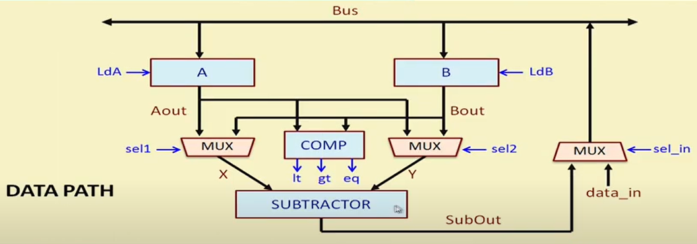
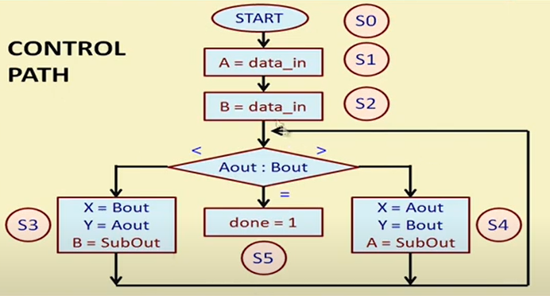

# Hardware Modeling Using Verilog - NPTEL

By Prof. Indranil Sengupta (IIT Kharagpur)
Week 6 - Lecture 26 : DATAPATH AND CONTROLLER DESIGN (PART 2)

Design and simulation of datapath and control path for finding GCD of two 16-bit numbers.

Datapath:  

Control Path:  

Image credits to NPTEL