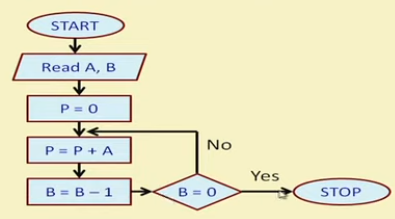
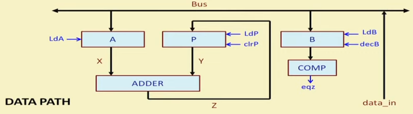
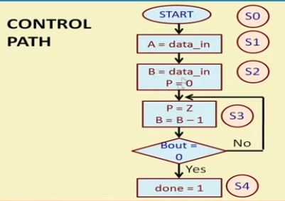

# Hardware Modeling Using Verilog - NPTEL

By Prof. Indranil Sengupta (IIT Kharagpur)
Week 6 - Lecture 25 : DATAPATH AND CONTROLLER DESIGN (PART 1)

Design and simulation of datapath and control path for a 16-bit multiplier.

Algorithm:

Datapath:

Control Path:
